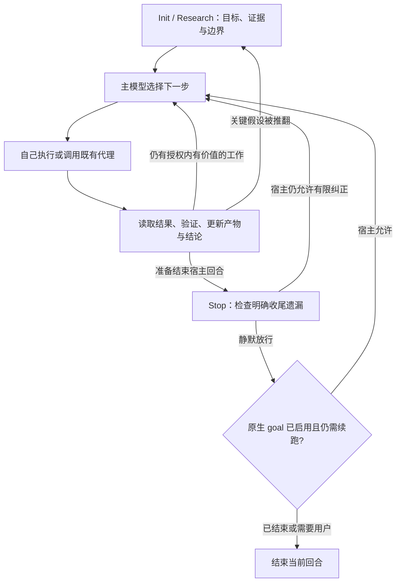

# Ultra Goal：四宿主对抗审查与最小方案

2026-09-04。三家各三轮对抗讨论已完成；本报告是架构决策与验证记录，不是实现交付或发布承诺。

**建议把 Ultra Goal 做成“主模型持有目标与反馈、脚本记录可核对事实、hook 补漏、宿主提供执行与续跑”的 skill。** 最有价值的改进，是让目标更准确、任务选择更灵活、反馈真正进入下一步决策、完成有依据。Stop 拦截只承担其中一个很窄的职责。

这里要区分模型的思考强度、一次宿主回合中的工具循环、跨回合的原生 goal、Ultra 的业务迭代。它们不是同一个计数器。Skill 可以组织调查、反驳和验证，使用宿主实际提供的思考设置；不能凭提示词获得宿主未暴露的运行能力。

## 1. 我们现在的实现

评审基线是 main 的 b07e2a8f1acd769b3d16f7f92cffe36d4499c76e，manifest 为 2.8.0。另审了 host-adaptation 的 f15a003d6715b974e0de19a4e880d6bb3395dc3c 快照；它是候选，且活工作树正在被另一任务修改。版本号不代表发布已经完成。

目前前半段是访谈，形成 Intent、Anchor、Stop condition、Boundary、Roles 等约定，写 goal 与 decisions。后半段通过 goal-run 武装 .goals/active；Stop 执行 anchor，记录事件，再决定本次是否让模型继续。已有 Carry-over、失败观察与审查技能。

值得保留的部分：目标和证据有明确落点；可丢弃手段与必须满足的结果有所区分；模型的完成声明能和命令观测并排检查；重要理解保存在文件中。

需要改变的部分：

- “gate 本身就是 loop／替代原生 goal”说得过强。main 在 stop_hook_active 为真时直接退出，实际上只提供有限纠正。去掉这条判断也不等于得到可靠的跨宿主循环。
- 同一份 Stop 输出不能跨家混用。CC 的 allow 附加 additionalContext 会续跑；Codex 拒绝带 hookSpecificOutput 的 Stop 输出；Kimi、zCode 的 allow 反馈又有不同投递限制。前两项已做真实 CLI 探针。
- active 只按目录和 slug 指向目标，缺少当前会话归属，另一个相同 cwd 的任务也可能触发检查。真实 session ID 是归属信息，不是防伪密钥。
- 相同失败输出或文件树没有变化，不能证明没有进展；两次失败便退出会误伤调查和长期修复。文件摘要可识别被检查的是哪份内容，不负责判断策略是否有效。
- 固定九问、固定 reviewer/critic、禁止计划、每轮提交、冻结整个理解，和用户要的灵活运行存在冲突。保留目标、权限和已接受条件的边界，让研究方法、任务拆分和人员选择随证据调整。

Codex 的插件会在 manifest 未填写 hooks 时默认发现 hooks/hooks.json。因此不能仅凭 manifest 缺字段，就说 main 的 Codex hook 没注册。是否实际安装、启用且受信任是另一项运行事实。

## 2. 四家原生目标模式和 Stop 的实际边界

| 宿主／检查版本 | 原生 goal 主要利用什么 | Stop 能要求什么 | 关键限制 |
|---|---|---|---|
| Codex 0.150.1；源码 03861e69 | 持久目标状态、宿主空闲续跑、用量记账；主模型通过 create/get/update_goal 管理暴露的状态 | block/reason 或 exit 2＋stderr 使模型继续；exit 0 静默放行已实跑 | 检查的循环源码没有固定续跑上限，不等于无限保证；Stop JSON 严格；模型工具不能暂停／恢复 goal |
| CC 2.1.260 | /goal 是会话级 prompt Stop hook，独立小模型读会话，给出未满足／满足／不可能 | 同步脚本可否决结束；Stop additionalContext 也会续跑，已实跑 | 连续无工具进展的续跑有默认 8 次保护；工具使用会重置相关计数；评估器不独立运行验证命令 |
| Kimi 新版 TS 0.40.1 | goal driver 包住普通 turn，主模型 CreateGoal／UpdateGoal，宿主处理目标预算和状态 | 外部 Stop 每个普通 turn 最多一次纠正 | 后续可能没有第二次 Stop；UserPromptSubmit 只在真实用户输入触发，自动 goal 续跑不触发 |
| zCode CLI 0.16.5 | 会话目标持久化，另一次模型校验输出 passed/reason/nextAction，再决定续跑 | 同步 Stop block＋非空反馈，最多连续 3 次 | allow 附带上下文不能当可靠投递渠道；校验器错误／非 JSON 的部分路径返回 passed=true，已做提取函数复现 |

来源：[Codex goal 文档](https://developers.openai.com/cookbook/examples/codex/using_goals_in_codex)、[CC goal](https://code.claude.com/docs/en/goal)、[CC hooks](https://code.claude.com/docs/en/hooks)、[Kimi 源码](https://github.com/MoonshotAI/kimi-code/tree/0d45dddc57510e6b1306dd12c0b0703c37b8c63a)、[zCode goal](https://zcode.z.ai/cn/docs/goal)、[zCode hooks](https://zcode.z.ai/cn/docs/hooks)。详细本地路径、源码位置、版本与证据等级见附录。

CC 还提供 asyncRewake，可以在异步 hook 失败时唤醒空闲会话。因此“所有 hook 都无法唤醒会话”不准确；但它是宿主专用能力，不作为跨四家方案的必要条件。

原生目标状态也不是产品完成证明：Codex/Kimi 是主模型声明；CC/zCode 的独立评估器仍有证据可见性和错误路径。Ultra 应先把正常工具输出和实际产物放进模型可见的流程，再形成完成判断。

## 3. 前半段怎样结束研究、进入执行

先从用户已经说过的内容和仓库事实中填最小约定：要改变的结果、范围和权限、完成证据、不能自行变更的约束、什么情况需要用户决定。只追问缺失且会改变下一步的材料，不重复访谈。

Research 的循环是：找出会改变目标或方案的未知 → 查资料／读源码／做最小实验／请求独立反驳 → 更新理解 → 选择下一个有价值的未知。

当模型已经能说明“下一项有用的授权内行动是什么、做完如何判断、还有什么关键不确定性”时，就可以执行下一小步。发现重大不可替代的用户决策才暂停询问；不要求先把所有可能问题都研究完。

明确改变目标、放宽验收、增加用户设定的资源上限或扩大外部效果时，按现有授权处理并记录决定。普通方法调整和任务重排由模型做。固定的是用户确认的目标、验收和权限；调查结论、假设、方法与分派不应一起被冻结。摘要只能发现文字发生变化，不能独自裁决是否改变了用户的意思。合法修改目标后建立新证据基线，保留旧观察，不能让第一次 frozen digest 永远阻止新约定。

继续条件是：用户目标仍有效、必需结果尚未满足、还有授权内有价值的行动，并且宿主没有因取消或资源限制停下。研究与执行可以来回切换；新证据推翻关键假设时，回到对应研究问题即可，不需要重走整套 Init。

完成、需要用户决定、暂时受阻、预算耗尽、运行错误要分别表达。达到技术上限或无法判断，不得被包装成完成。没有合适机械验收命令的研究任务，仍可以靠原始来源、实际材料与语义审查建立证据，不造一个总是 exit 0 的假 anchor。

## 4. 后半段怎样自动分派、反馈和更新

下面的图区分了业务循环和 Stop 所在的位置。用户中断、宿主错误等路径可能直接终止，不保证经过 Stop。

业务循环发生在宿主已有的模型—工具循环内，一次宿主 turn 可以包含很多业务迭代：

目标与现状 → 选下一项有价值的工作 → 自己做或委派 → 等待并读取实际结果 → 验证／必要的独立反驳 → 更新结论和产物 → 判断是否还需要下一轮。

执行者由主模型按任务依赖、所需能力和错误代价选择。小任务直接做；值得并行的独立问题用已有 native subagent 或 agent-delegate。任务包写明目标、输入、交付、继承权限和需要另行批准的效果，不削弱普通代理的工具能力，也不悄悄替换用户指定的评审者。

委派成功、进程 exit 0、代理声称完成，都要和任务结果分开看。必须读取产物和相关验证；无结果就是未知。必须等的 worker 要有明确的 wait/result 路径，没有已验证的后台唤醒就留在当前 turn 等，不靠反复 Stop 拦截轮询。与本目标无关的后台监控不能使 Ultra 一直等待。

验证放在普通工具调用：适用测试、真实产品路径、文档出处或用户约定的其他证据。记录命令结果对应的目标版本和相关产物；验证之后若相关产物又变了，完成前重新核对并按变化决定所需复验。标识匹配只说明对应关系，不说明内容正确；也不能把 Carry-over 更新或无关文件变化当成整套验收自动失效。只在用户要求或错误代价需要时独立复审。评审可以是文件、工具返回或原生子代理结果；缺某个固定文件不等于没审过。

结论更新到三个既有位置：goal.md 保留当前认识、未完成项和下一步；decisions.md 记改变做法的证据与取舍；实际项目文件／用户指定的交付位置承载成果。events.jsonl 记录观察来源和对应内容，必要证据保留为附件。没有授权时，不自动提交 Git，也不将内容写往 Notion、外部记忆或其他系统。

## 5. Hooks 如何用，什么时候拦、什么时候放

| 位置 | Ultra 的合适用途 | 不应承诺的能力 |
|---|---|---|
| SessionStart／可注入的恢复事件 | 给当前会话一个短的目标与状态文件指针 | 所有宿主、所有压缩路径都支持注入 |
| UserPromptSubmit | 在宿主允许时补充状态，主模型理解新的用户方向 | 用停／继续等关键词正则推断授权；把 Kimi 用户事件当自动续跑事件 |
| PreToolUse | 真有需要时检查明确、可机械判断的操作约束 | 默认覆盖每个原生工具，或替代语义判断与宿主权限 |
| PostToolUse／Failure／Subagent 事件 | 记录可用的结果与归属，支持模型整合反馈 | 事件收到就等于任务成功，或一定能唤醒主模型 |
| Pre/PostCompact | 保存已有状态／在确实可用的通道提示重读 | 从磁盘恢复从未写下的推理 |
| Stop | 检查明确收尾遗漏，提供有限纠正 | 任务调度、全过程验证、无限自动续跑、撤销先前工具效果 |

推荐 Stop 只做很短的事情：识别所属 run，查看明确约定的收尾义务和已有证据，然后决定是否有一次纠正的价值。完整测试不应在每次 Stop 中重跑。

| 条件 | Stop 行为 | 完成状态 |
|---|---|---|
| 未启用、cwd 缺失、会话不匹配、无关 worker | 静默 exit 0；不认领、不改状态 | 不作判断 |
| 已知还有一个当前权限内可修正的收尾遗漏，且宿主仍提供纠正机会 | 有意 exit 2，stderr 说明具体缺口 | 未完成 |
| 必需检查明确失败／当前所需证据缺失 | 能继续则请求有限纠正；否则保留失败／未知并交给正常流程说明 | 不自动完成 |
| 正在等待属于本目标的必要任务 | 使用已支持的 wait/result 路径 | 不作完成判断 |
| hook 超时、异常、不可判断，或纠正机会已耗尽 | 按宿主约定放行，保留可恢复诊断 | 放行不等于成功，也不等于暂停原生 goal |
| 用户中断、暂停、改变方向 | 服从原生控制与当前用户意图；Stop 可能根本不会触发 | 不擅自恢复 |
| 适用验收已经由当前证据支持，无必需工作剩余 | 主模型记录结论，调用实际可用的原生完成操作；Stop 静默放行 | 语义判断，不能由勾选框／时间戳自动推导 |

脚本异常不能误用 exit 2，因为四家把它当作“有意纠正”。CC 第三轮还实测了 Python 文件不存在、argparse 参数错误均会返回 2，所以保护必须覆盖启动路径和参数处理，不能只靠脚本内部 try/except。宿主身份应由明确的适配入口提供，不能从几家相似的 stdin 形状猜测。现有 python3 脚本 || python 脚本 启动器也须调整：隔离复现中它运行了两次脚本，第二次 stdin 为空并返回 0，把原先的退出码 2 吞掉。应先选择解释器，再只执行一次并保留状态。放行不要附带“继续做……”的模型上下文。具体 JSON 增强只在宿主确认支持时使用。

stop_hook_active 也可能由别的 hook 或原生 goal 设置，保守跳过重入意味着零或一次机会，不能宣称每个业务迭代必有一次兜底。Kimi 最后一次纠正后不保证再回调，重要结论必须在正常工作时写好。

Stop 位于工具执行之后。例如 Kimi 的 UpdateGoal 会先改状态，再走最终消息和 Stop。后来的纠正不能撤销那次完成状态更新。若某项效果必须事前拒绝，须验证该工具真的经过 PreToolUse，再加入相应的确定性检查。

## 6. 原生 goal 和恢复如何衔接

原生 goal 只在实际可用、实际启动后提供跨回合续跑。启用前先确认当前表面的真实入口、完成机制和需要停下时的路径：有原生完成／阻塞工具就按其契约使用；依赖独立评估器时，完成条件必须能由普通工具已经呈现的证据判定，并明确用户接管方式。条件不具备时，不由 skill 自动武装。写文件、打印 /goal 命令、返回 allow 都不是启动操作。Codex 有 create_goal 和 update_goal；Kimi 有 CreateGoal／UpdateGoal／SetGoalBudget；CC 有 ProposeGoal，但审批策略由宿主设置决定，模型不能自行 clear；zCode 已核实用户命令和 headless --target；安装包中可见只读 GoalRead（注册条件未完整确认），未找到对模型开放的创建／暂停／清除工具，不能从自然语言宣传推导这类能力。

缺少控制接口时，使用宿主的真实用户入口或明确声明该表面不提供自动启动／暂停能力。Ultra 的完成记录与宿主 goal 状态分别解释，不能靠删 active 文件宣称两边同步停止；不直接修改宿主数据库，也不藏一个子进程循环。

恢复先写后读：重要决定、结果和任务归属在获得时就写下；恢复时核对当前用户要求与真实工作区。Kimi 自动续跑跳过 UserPromptSubmit，因此原生目标提示本身要包含 canonical goal 文件和重读义务。zCode 文档列 compact，但已查安装源码调用点仅见 startup/resume，压缩注入不作为当前承诺。历史 active 文件不授予新的继续权限。

## 7. 最小实施顺序与验收

这次只形成方案，不改实现。下一步应做一个真实的纵向切片：先把正常工作中的验证与状态更新接通，再加会话归属和正确的 Stop 协议，最后按宿主验证包装、恢复和可选原生 goal 衔接。复用已有脚本与文件，删除不再必要的固定流程和计数推断。

每个拟支持的宿主至少验证：激活后确实收到 hook；故意漏一次必要步骤能够纠正；真正放行能够结束；错误／超时不会记成功；同 cwd 的另一个 session 保持无影响；取消和压缩／恢复遵守真实生命周期；必要 worker 结果收齐后才形成结论；原生 goal 已停与 Ultra 证据不足时如实报告。没有实际跑过的表面标为未验证。

当前完成的真实探针覆盖 Codex 与 CC 的最小 Stop 消费路径，另有 CC allow-context 续跑与 Codex 非法组合载荷不生效的复现。Kimi/zCode 的关键结论来自源码和隔离函数检查；四家完整无人值守业务链未完成验证。

## 8. 三轮讨论结论与置信度

实际通过 agent-delegate 调用了 Claude Code、zCode、Kimi，各完成三次有实质产出的审查，共九份报告；第二轮阅读并反驳其他报告，第三轮审查共同候选与新增探针。Codex 负责独立审查、交叉质询、证据复核和最终裁决。

| 轮次 | 论证方式 | 对方案产生的实际改变 |
|---|---|---|
| 第一轮 | 三家分别审代码、宿主机制和各自反例 | 揭露 Stop 输出不兼容、重入与轮次混淆、恢复缺口、固定流程与产品目标冲突 |
| 第二轮 | 交换报告，逐条质询 | 撤回日志防伪、文件新鲜即完成、UI 消息充当模型证据；确认 Kimi 真正的 goal 工具面与用户事件边界 |
| 第三轮 | 攻击同一候选、加入真实宿主探针 | 三家均有条件通过架构；确认普通工具验证为主、Stop 有限补漏；补齐启动器、激活前检查、证据与产物对应关系 |

已采纳三家的必要条件：会话归属；只检查该任务实际要求的证据；静默放行；正确启动器；明确原生 goal 的操作与退出路线；完成前核对当前产物；把完整无人值守能力留给真实运行验收。

主审另作四条限定：

1. 没有 native goal 不等于只能有人值守。普通宿主 turn 本身就能长时间执行多步任务；本次 Kimi 第一轮持续约 56 分钟，原生 trace 记录 134 次工具调用，未出现 CreateGoal 调用或 goal 事件。没有保证的是结束后自动开启下一 turn／进程死后复活。
2. “最终报告必须披露分歧”适用于模型仍有输出机会或下次恢复；不能承诺在宿主已强制结束后，skill 还能主动覆盖原生 UI 的完成标记。持久证据必须提前写好。
3. 相似的 hook 输入不能可靠识别宿主；使用明确的适配身份和真实 session ID。Kimi 模型可以 UpdateGoal(active)，不能把“hook 子进程无控制对象”扩大成“skill 指导的主模型也无控制工具”。
4. CC 共存探针出现模型自造 token-rotation 文本，但没有明确的评估器裁决记录，不能据此确定是哪个机制导致。它不算原生 goal 与 Stop 优先级已经验证。

**结论：架构方向可以确定，实施前提和能力边界已明确。不能据此把整个四宿主方案标成“95%以上已验证”。** 三轮论证与两个宿主的最小传输探针，支持高置信的架构判断，尚不支持四家完整无人值守的可靠性承诺。若 95% 指实测成功率，还需先定义任务样本和统计口径；若指进入实施前的工程把握，当前方案已经收敛到不依赖未验证宿主能力的基础层。

Kimi 三轮的代理回执分别带 185／67／31 条 Internal error 协议告警，同时均返回 success/end_turn 并写出实质报告。第三轮原生 trace 可见 Read 失败后使用 Bash 读取、最后 Write 成功。报告已收到与 ACP 链路健康是两个结论；这次没有诊断或宣称后者。

完整原始讨论、主审裁决、实验与回执索引见同目录 README.md。
